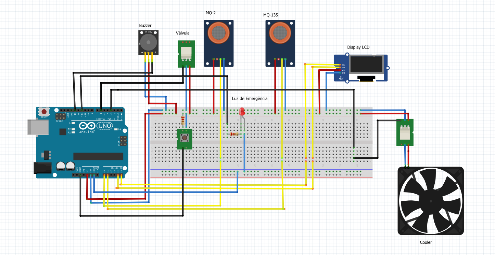
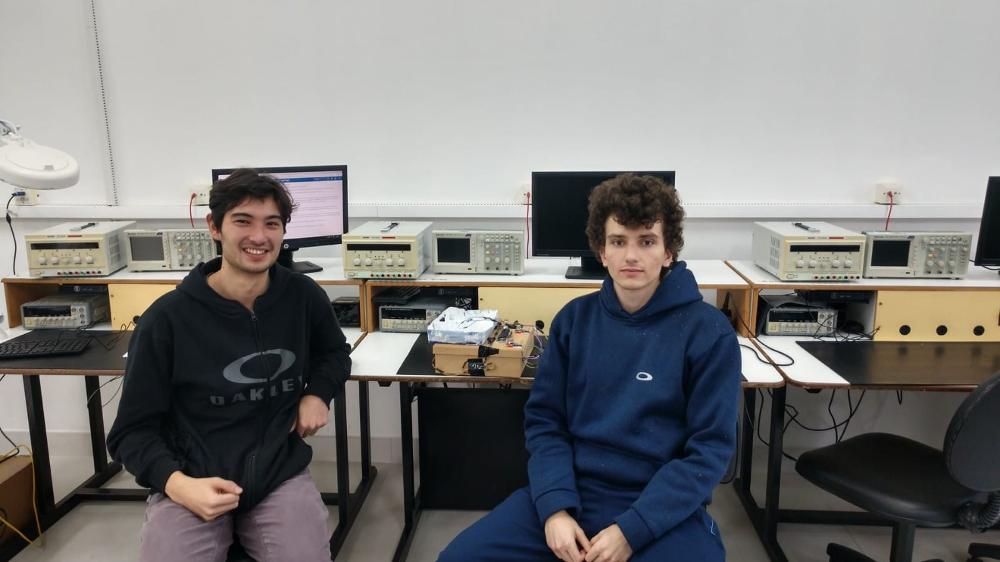
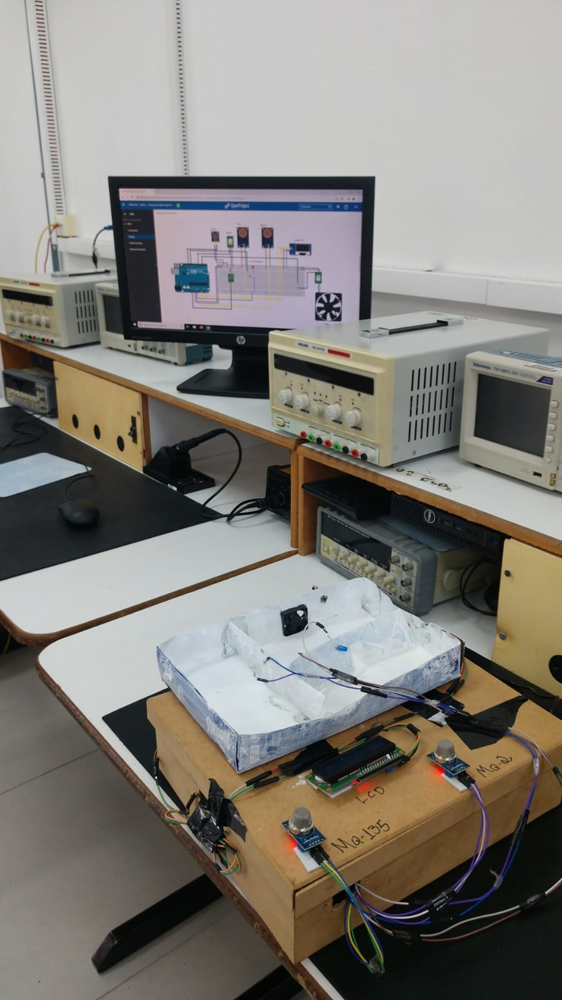

# Monitoramento de Gás - André Outi e André

Introdução:  
Esse projeto tem como objetivo desenvolver um dispositivo que seja capaz de monitorar e controlar gases em ambientes domésticos, visando a segurança e o bem estar do usuário, uma vez que as residências escondem perigos que colocam diariamente nossa vida em risco se não forem cuidados.

O gás liquefeito de petróleo (GLP) é um produto de extrema necessidade no cotidiano da grande parte da população, sendo ele um produto inflamável, apresenta um certo risco se não tomar os cuidados necessários. O gás carbônico (CO2) por sua vez é um gás que pode ser encontrado em diversos locais, como em indústrias, alimentos e até mesmo na própria atmosfera, no entanto se não estiver com a concentração adequada ele pode acarretar em sérios problemas de saúde.

Concepção:

O projeto foi pensado para ser um protótipo de um sistema integrado de sensores de gás e de qualidade de ar distribuídos na cozinha (sensor de gás) e nos outros cômodos (sensor de qualidade de ar). O sistema lê a qualidade do ar (nível de CO2) e se o valor lido exceder um limiar predeterminado, o sistema aciona dispositivos de exaustão de ar. Quando gás de cozinha é detectado, as luzes do cômodo é desligado, ligam-se luzes de emergência, assim como um alarme, por fim uma válvula é acionada para fechar o gás. Em condições normais o sistema lê o sensor de qualidade do ar e mostra em um display se o ar está na faixa adequada de CO2 para ser respirável.

Não sendo preciso programar nada, o sistema trabalha de maneira autônoma controlando partes da casa para prover um ambiente seguro e com qualidade de ar.

Na parte de interface do usuário terão alarmes sonoros, luzes indicadores de status  e um visor  que irá mostrar a concentração dos gases.

Na parte do controle automatizado de respostas aos diferentes níveis de concentração dos gases monitorados, teremos seis mecanismos principais:

Ativação de exaustor a fim de dissipar os gases indesejados;

Painel com luzes ;

Mensagem verbal via visor acoplado ao dispositivo, indicando os níveis de gases e o status atual do ambiente;

Alarme sonoro para notificar os usuários em casos de emergências;

Uma válvula eletrônica que quando acionada é capaz de fechar o vazamento de gás;

Além do corte da alimentação da iluminação própria do cômodo onde vaza o gás para evitar incêndios ou explosões.

## Maquete eletrônica

## [Código do projeto](./codigo.ino)

## Foto dos alunos e do projeto:

Referências:

MINISTÉRIO DO MEIO AMBIENTE. Guia Técnico para Monitoramento e Avaliação da Qualidade do Ar. Disponível em: https://www.gov.br/mma/pt-br/centrais-de-conteudo/mma-guia-tecnico-qualidade-do-ar-pdf. Acesso em: 26 de abril

SÃO PAULO. FREDERICO HERMANN JR.. (org.). **Padrões de Qualidade do Ar**. 2022. Disponível em: https://cetesb.sp.gov.br/ar/padroes-de-qualidade-do-ar/#:~:text=Os%20padr%C3%B5es%20de%20qualidade%20do,Resolu%C3%A7%C3%A3o%20CONAMA%20n%C2%BA%2003%2F90. Acesso em: 02 abr. 2022.
