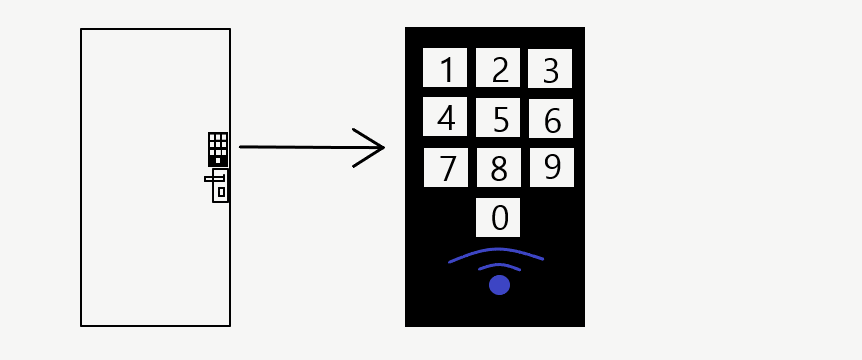
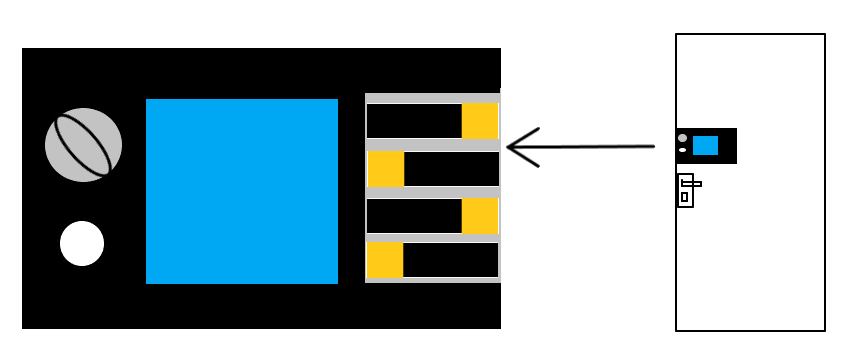
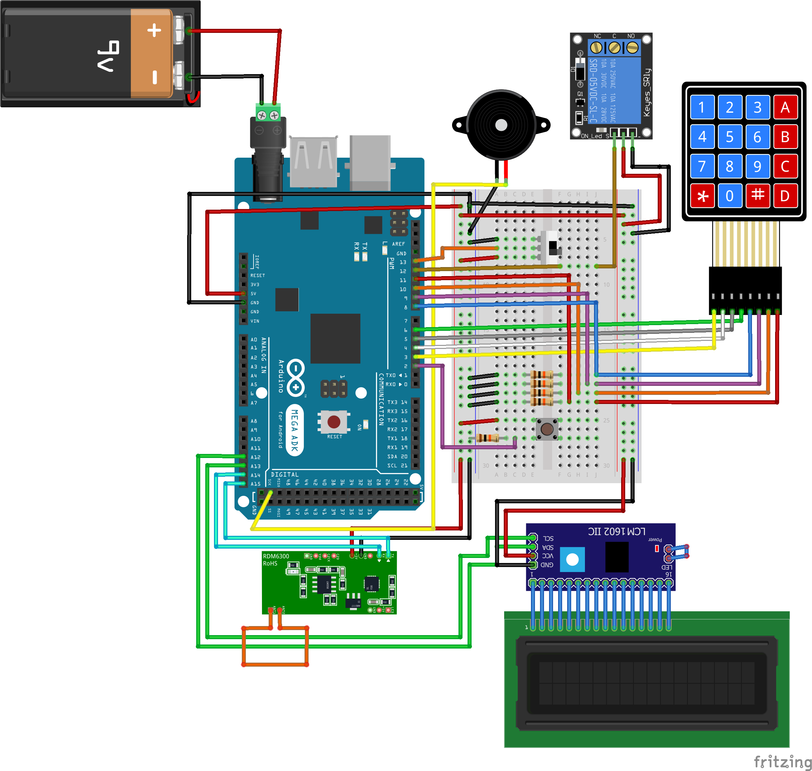
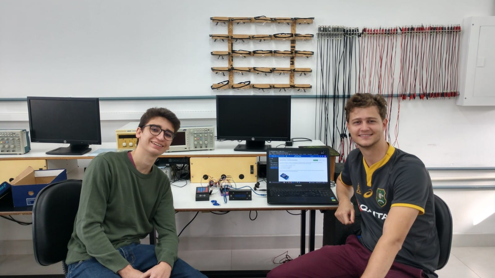
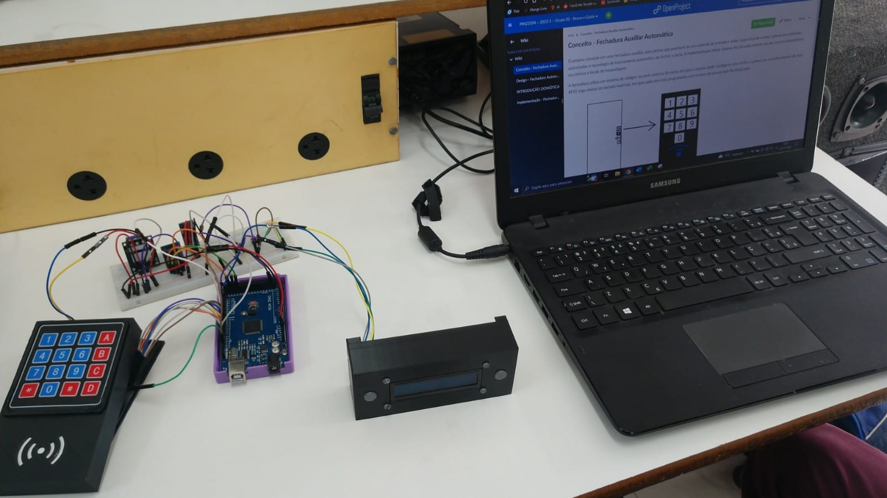

# Porta Automática - [Bruno](https://github.com/BrunoPuls) e [Guido](https://github.com/GuidoMomm)

O projeto consiste em uma fechadura auxiliar, para portas que precisam de um controle de entrada e saída; segurança de acesso apenas para pessoas autorizadas e tecnologia de trancamento automático ao fechar a porta. A implementação desse sistema foi pensada visando ao seu uso em laboratórios, escritórios e locais de hospedagem.

A fechadura utiliza um sistema de códigos na parte externa da porta, em que o usuário pode configurar uma senha, e possui um reconhecimento de tags RFID, logo abaixo do teclado matricial, em que cada uma está programada com o nome da pessoa que foi designada.

Na parte interna há dois botões um para abertura da fechadura e outro para visualização do display que indica os últimos 5 acessos a porta com data e horário. 

O sistema é alimentado com uma fonte de tomada e caso caia a luz os dados dos últimos acessos continuam salvos e na memória e podem ser acessados novamente.

A ideia é o sistema ser de fácil implementação pelo usuário, fazendo-se sua a instalação com apenas um furo pequeno na porta, para comunicação da parte externa com a parte interna, e um gabarito com parafusos, para o encaixe correto do sistema interno e externo.

## Maquete eletrônica

## [Código do projeto](./codigo.ino)

## Foto dos alunos e do projeto:

