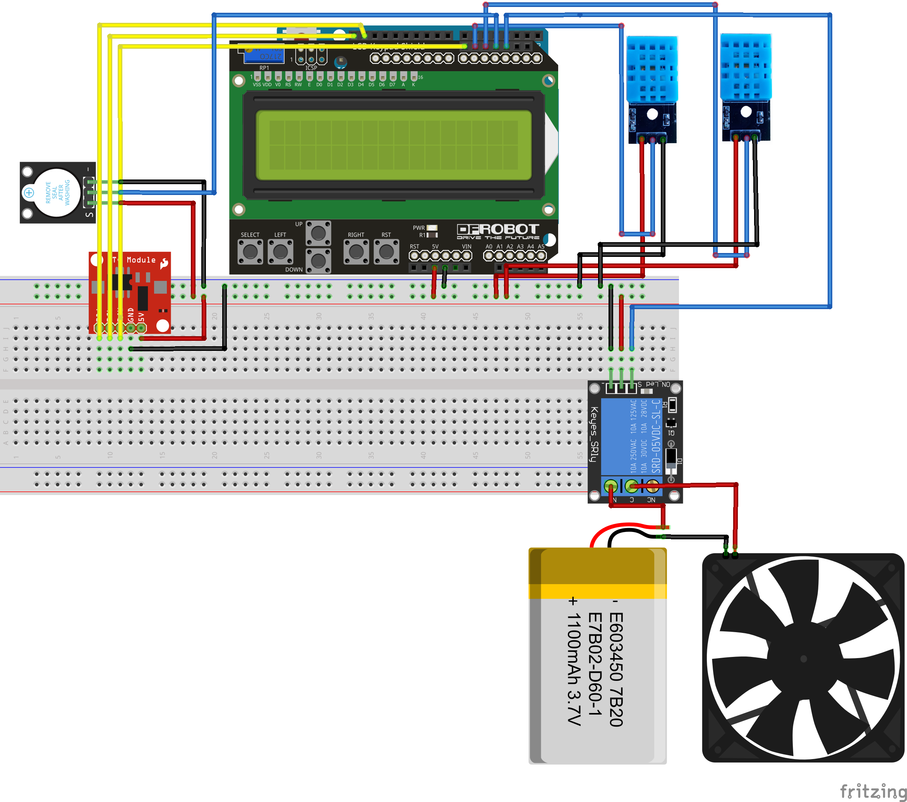
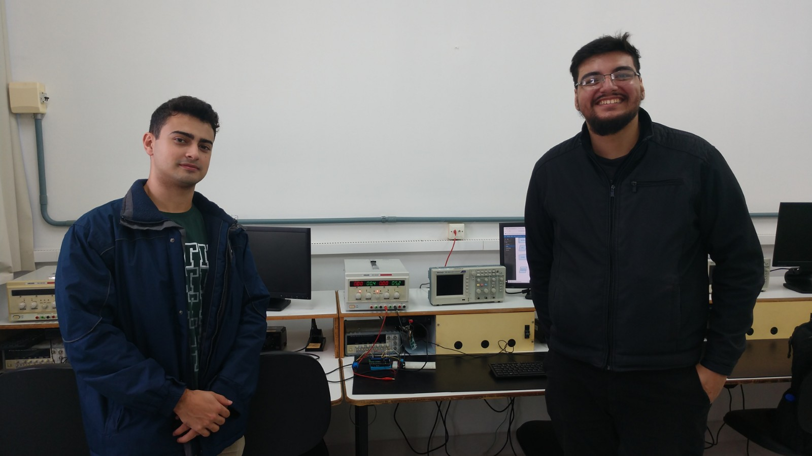
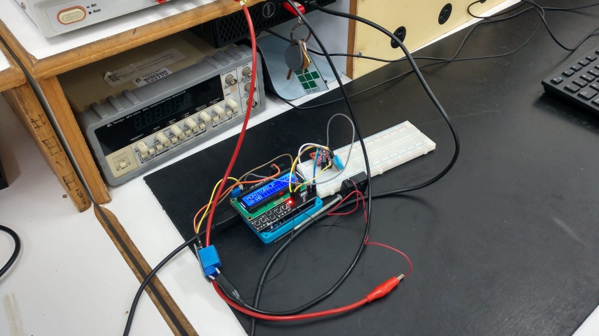

# Sistema de Controle de Ar-condicionado Inteligente - Gustavo Marçal e Gustavo Barbosa

**Introdução:**

- A proposta é fazer um produto simples, barato e prático com o objetivo de controlar a temperatura ambiente de acordo com o que você está fazendo.
- Com o ambientador você poderá ter uma melhor eficiência do que você está fazendo, desde uma melhor noite de sono, uma melhor concentração dos seus estudos, e até para a realização de exercícios físicos.
- Ele terá uma interface simples com perfis pré-programáveis, onde ele irá controlar o ar condicionado do seu cômodo de uma maneira eficiente para você sentir-se mais confortável. Além de ter uma tela informativa de dados como temperatura interna/externa e umidade relativa do ar.

**Metodologia:**

- A partir da proposição do desenvolvimento de um sistema inteligente micro-controlado para ambientes domésticos, com a temática de temperatura, realizamos um *brainstorm* para avaliar as necessidades e possíveis soluções relacionadas ao tema.
- Ideias como resfriamento de eletrônicos por fluidos, controle de temperatura de armazéns, ou até mesmo incubadoras para criadores de aves e répteis foram cogitadas. Decidimos partir para uma visão mais generalista do tema, abordando a temperatura e bem-estar do ambiente doméstico como um todo.
- Propomos a elaboração de um sistema de controle de ar-condicionado inteligente, com perfis pré-programados pelo usuário que busquem ajustar a temperatura dos cômodos de acordo com as atividades previstas para o horário (dormir, estudar, atividades físicas, etc).

**Requisitos de Software do projeto:**

- Deverá possuir uma interface gráfica inicial, que apresente as seguintes informações:
  - Temperatura interna e externa;
  - Umidade;
  - Data e Hora;
  - Perfil habilitado (informando seu tempo de duração e próximo perfil);
- Deverá possuir um menu de troca rápida entre os perfis, para uma utilização esporádica de 15 min, 30 min ou 45 min, sem a alteração da programação semanal vigente.
- Deverá possuir um menu de configuração avançada que permita:
  - Adição, remoção ou alteração de perfis existentes (horário ativo, nome do perfil, temperatura, exibição no menu de troca rápida);
  - Deverá incluir um perfil para manter o ar condicionado desligado durante um período programado (perfil “desligado”);
  - Deverá realizar a diferenciação entre os dias da semana, com os perfis sendo configurados para cada dia;
  - Permitir o ajuste da data e hora atuais;

**Requisitos de Hardware do projeto:**

- Deverá possuir um display para exibição da interface gráfica com o usuário, em conjunto com outros dispositivos de entrada que serão definidos pelos projetistas;
- Deverá possuir um circuito para aferir o tempo com, pelo menos, as informações de: mês, data, dia da semana, horas, minutos e segundos.
- Deverá possuir memória interna não volátil para armazenamento dos perfis e configurações do usuário;
- Deverá possuir sensor de temperatura próprio, para monitorar e ajustar o funcionamento do atuador (ar-condicionado);
- Deverá possuir sensor de umidade, para sua exibição na interface inicial do sistema.

## Maquete eletrônica

## [Código do projeto](./codigo.ino)

## Foto dos alunos e do projeto:

