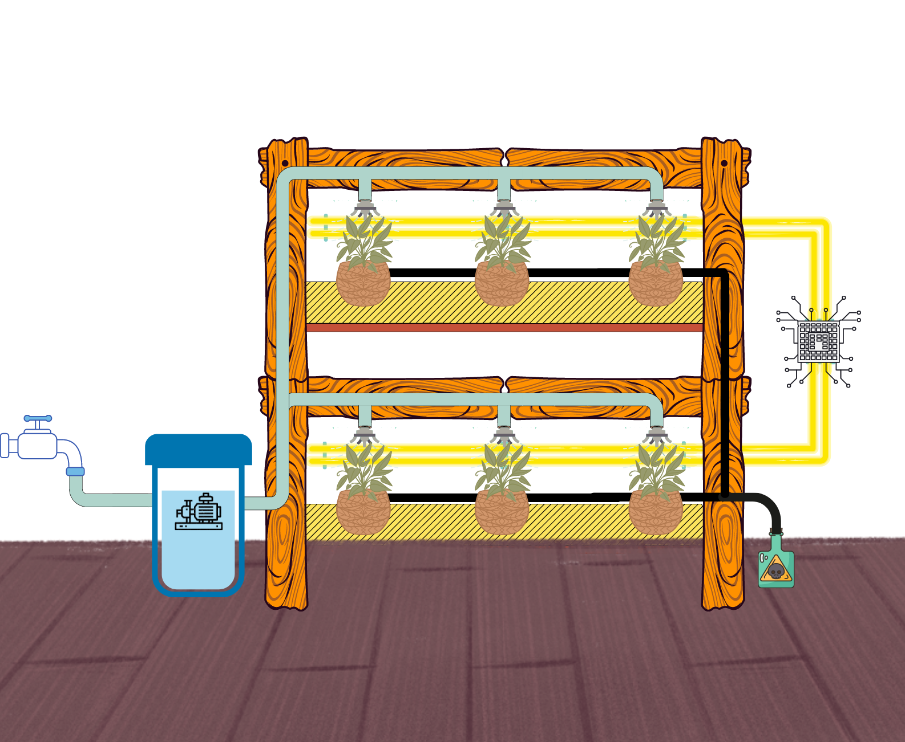
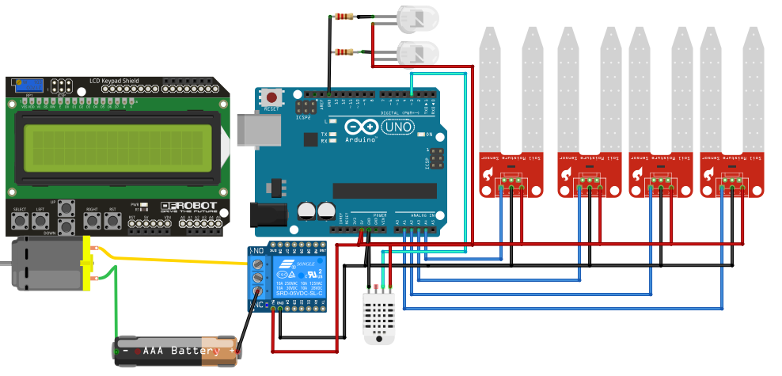
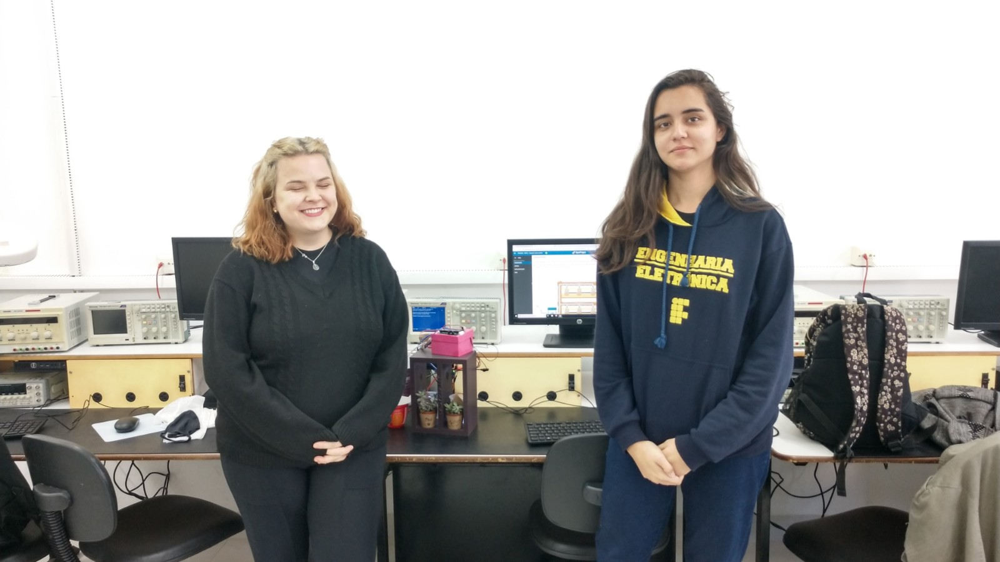
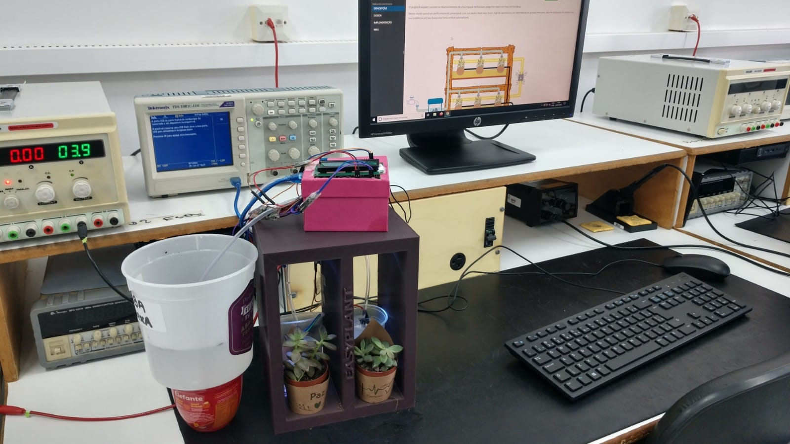

# Easyplant - [Joana](https://github.com/joananana?tab=repositories) e [Larah](https://github.com/LFRB-IFSC)

O projeto Easyplant consiste no desenvolvimento de uma irrigação vertical para pequenos vasos com foco em hortaliças.

Nosso cliente possui um perfil consciente, preocupado com sua saúde e bem estar, busca fugir de agrotóxicos e daS dependência de grandes mercados, além de otimização de espaços em sua residência, por isso busca uma horta vertical automatizada.

Nosso produto fornece ao cliente todos os componentes necessários para que ele cultive pequenas hortaliças com pouco esforço, com requisitos básicos mínimos de possuir uma fonte de água próxima e abrigo da luz solar.

**FUNÇÕES:**

- Medição de temperatura ambiente;
- Nível de água no reservatório;
- Nível de umidade;
- Controle de iluminação;

O sistema de irrigação vertical conta com sensores de temperatura para que se possa manter o ambiente monitorado, caso seja de interesse verificar a temperatura a qual as plantas estão expostas, possui um sensor para medição do nível de umidade que ativa a bomba de água e irriga as plantas, verifica o nível mínimo de água do reservatório para acionar o seu enchimento e luminosidade para o processo de fotossíntese.

Essas informações serão visualizadas por meio de um display LCD 16x2 e o cliente poderá visualizar informações e fazer a configuração dos parâmetros, por meio de botões, para controlar a umidade de cada vaso na sua pequena horta.

## Maquete eletrônica

## [Código do projeto](./codigo.ino)

## Foto dos alunos e do projeto:

